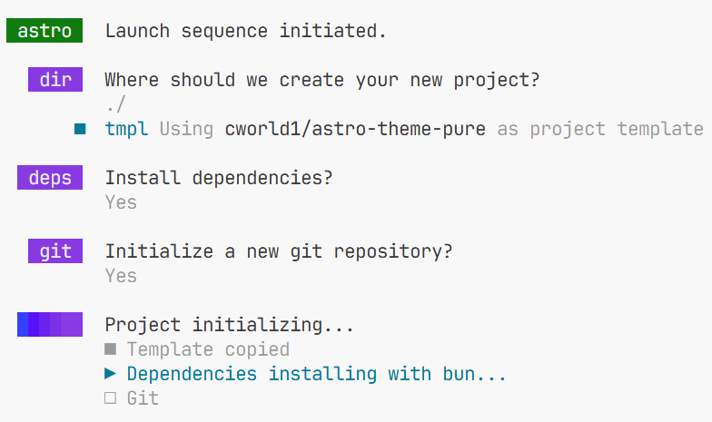
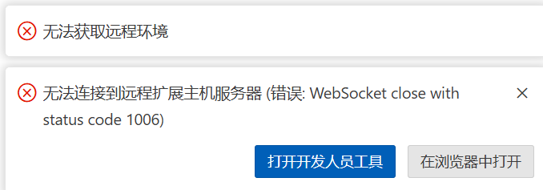

于是本人博客复活了，这里记载复活这一事件以及复活后发生的事件

这一天的晚上博主结束了“9993”的小会后终于又回到了地下室，
学一下数学吗？不要。干点什么呢？
思来想去，博主决定套用仰慕已久的Arthals大佬的模板，对博客实施大复活术（

于是

然而好景不长，仅仅数分钟后：
> [!CAUTION] 
>
> 内存爆了
>
> 25/09/23 00:13 Edge out of memory
> （（（第一次运行`bun dev`后，打开预览界面直接把电脑32G内存干爆了。wsl和edge双双退出
>

经过对卡住电脑的一番艰难操作，

关掉了**数据结构与算法**的PPT、**计算概论**的2个标签页后，成功重启了`bun dev`

此间略去五个小时中发生的颇多事件与挣扎，总之在
2025/09/23 05:20这个也许有一定意义的事件点，博主完成了乱七八糟的模板内容的修改、markdown-admonitons插件的配制、waline的配制、域名的购买与解析。终于敲下了这一行字。

>[!IMPORTANT]
>
> 总之，这就是了。

*博客复活了，我呢？*